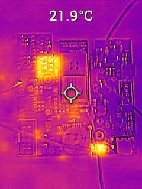
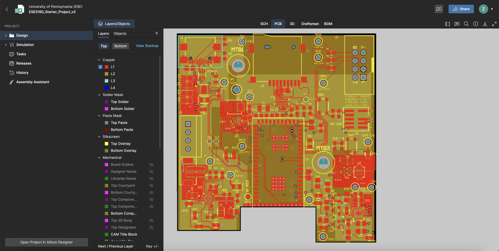
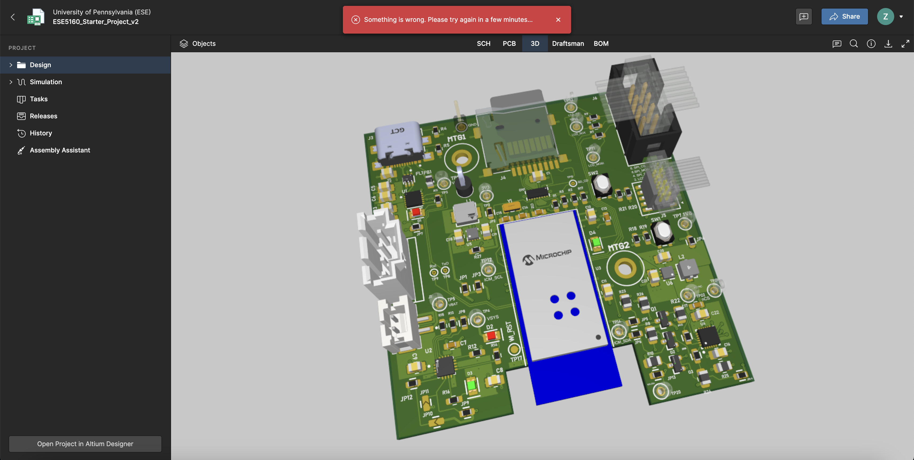
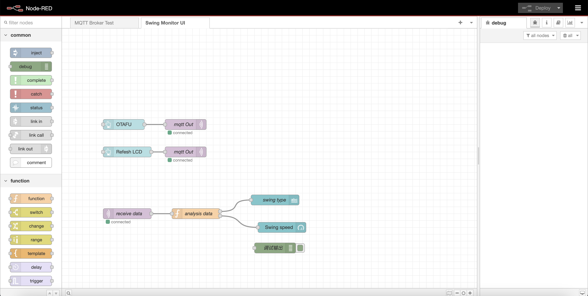
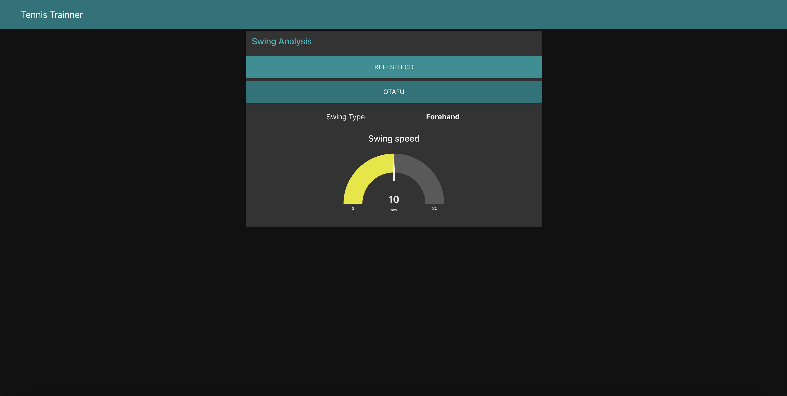
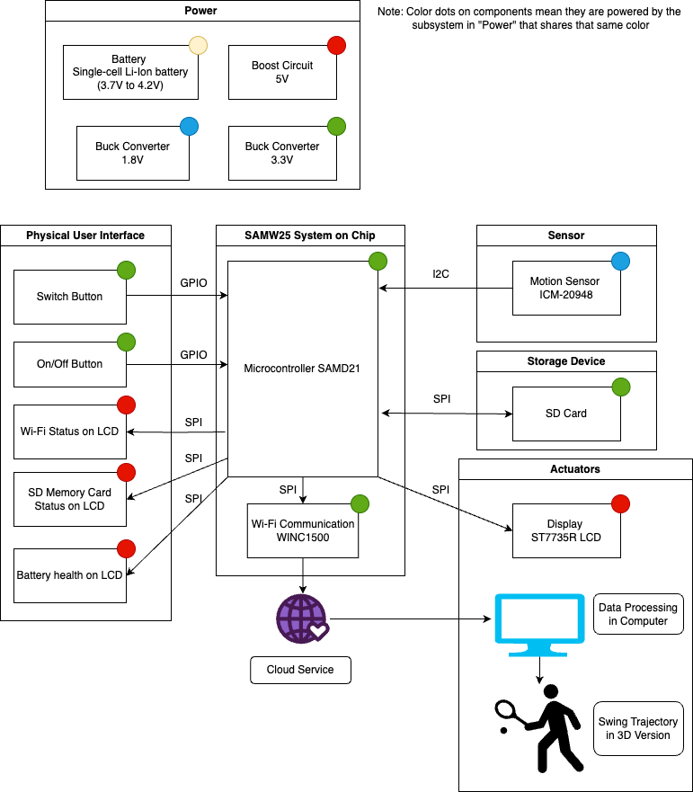

# a14g-final-submission

    * Team Number:24
    * Team Name:IDK
    * Team Members:Zhongkun Xue,Yanzhao Wang
    * Github Repository URL:https://github.com/ese5160/a14g-final-submission-s25-t24-idk.git
    * Description of test hardware: development boards, sensors, actuators, laptop + OS, etc

## 1. Video Presentation

https://drive.google.com/file/d/1_M48jvQIfONuINd9gaB8aoC9x6r87ObH/view?usp=sharing

## 2. Project Summary

Device Description: The Tennis Swing Trajectory Tracker is a compact IoT device that attaches to a tennis racket to record, display, and analyze swing motion in real-time. It provides immediate visual feedback, stores swing data, and enables players to pause and review performance using a built-in LCD.

Device Functionality: The system consists of an ICM-20948 9-axis sensor (accelerometer, gyroscope, magnetometer), a SAMW25 microcontroller, an ST7735R LCD, an SD card module, and a switch button, all powered by a Li-Ion battery and mounted on a custom-designed compact PCB. The LCD shows real-time trajectory, the button pauses recording and displays recent swings, and Wi-Fi enables remote data transfer.

Challenges：One of the biggest challenges we encountered was managing memory allocation efficiently within FreeRTOS. Specifically, we struggled with minimizing each task’s `task size` to fit within the limited available memory. Additionally, designing an algorithm to convert raw 9DOF IMU data into an accurate 3D swing model proved complex. These challenges pushed us to deeply understand task scheduling, memory optimization, and coordinate transformation under real-time constraints.

Prototype Learnings：

Through building and testing this prototype, we gained valuable experience in hardware design and embedded system integration. We learned how to design more debug-friendly PCBs by incorporating jumpers and breakouts, which made testing and troubleshooting significantly easier. We also became much more comfortable using FreeRTOS, particularly in managing concurrent tasks and ensuring time-sensitive operations are handled correctly.

If we rebuilt this device , we would redesign the PCB layout to better fit the physical structure of the tennis racket and select a more reliable and precise IMU sensor. This would improve both mechanical integration and sensor accuracy, ultimately enhancing the overall performance of the device.

Next Steps & Takeaways：

Although the device is already functional and well-integrated, one current limitation is the inability to transmit IMU data in real time to external applications like Unity, due to restricted memory. To complete the project and enable full real-time motion replication, we would need to increase available RAM or use more efficient task handling. This would allow us to stream data continuously for live 3D swing visualization.

From ESE5160, we learned the importance of RTOS in embedded development, particularly how to schedule and isolate tasks in real time. We also developed a strong understanding of bootloader structure, firmware update mechanisms, and the complete development cycle of an Internet-connected embedded system—from PCB layout to cloud communication.

Project Links：

Node-Red

http://48.217.65.123:1880/ui

PCB：

https://upenn-eselabs.365.altium.com/designs/54467BE2-7B2A-4019-87E0-7CC7A92E9B56

## 3. Hardware & Software Requirements

Hardware Requirements Specification (HRS)

| **Requirement ID** | **Requirement Description**                                                                         | **Performance Metric**             | Achievement |
| ------------------------ | --------------------------------------------------------------------------------------------------------- | ---------------------------------------- | ----------- |
| HRS 01                   | The system shall use the ICM-20948 sensorfor 9-axis motion tracking.                                      | Sensor data sampled at up to 1.1 kHz.    | YES         |
| HRS 02                   | The system shall display metrics in real-time using the ST7735R LCD.                                     | Display refresh rate ≥ 30 FPS.          | NO          |
| HRS 03                   | The system shall use the SAMW25 microcontroller to manage data processing and Wi-Fi communication.       | Data transmission latency ≤ 100 ms.     | NO          |
| HRS 04                   | The hardware shall be powered by a single-cell Li-Ion battery(3.7V nominal voltage).                     | Battery life ≥ 4 hours.                 | YES         |
| HRS 05                   | All components shall be integrated into a custom PCB for compact and portable design.                     | PCB dimensions ≤ 500x500 mm.            | NO          |
| HRS 06                   | The system shall include Wi-Fi functionality for data transmission via the SAMW25.                        | Wi-Fi range ≥ 10 meters indoors.        | YES         |
| HRS 07                   | The hardware shall include an SD card slot for data storage and retrieval.                               | Data write speed ≥ 3 MB/s.             | NO          |
| HRS 08                   | The system shall include a switch button to pause sensor recording and activate review mode on the LCD.  | Button response time ≤ 100 ms.          | YES         |
| HRS 09                   | The PCB shall include appropriate voltage regulators to provide 3.3V and 5V as needed for all components. | Voltage output variation ≤ ±0.1V.      | YES         |
| HRS 10                   | The hardware shall withstand typical tennis swings without detachment or damage.                          | Withstand forces up to 30g acceleration. | YES         |

* For **HRS 04, 05, 06, 08** the performance can be visually observed or easily measured.
* **HRS 01**: Performance is verified by measuring the number of data points read per second, using a counter variable to log the data rate.
* **HRS 02:**  This requirement we found it unnecessary as we only want to refresh numerical data on it so we don't have specific requirement on that.
* **HRS 03**:  Latency is measured by logging timestamps before sending and after receiving data, then calculating the delay to ensure it is ≤ 100 ms.
* **HRS 07:** Measure the time taken to write a known data size (e.g., 6 MB), then divide size by duration to confirm the write speed exceeds 3 MB/s.
* **HRS 08:**  Measure the time between a button press and the corresponding LCD update using timestamps.
* **HRS 09:**  Use a multimeter and oscilloscope to measure the outputs on your PCB.
* **HRS 10:**  Verify IMU performance by checking the peak acceleration after swinging the racket; ensure it can reach 30g, although such high speeds are not required in practice in the end.

Software Requirements Specification (SRS)

| **Requirement ID** | **Functionality Description**                                                                         | **Performance Metric**               | Achievement |
| ------------------------ | ----------------------------------------------------------------------------------------------------------- | ------------------------------------------ | ----------- |
| SRS 01                   | The system shall collect and process motion data from the ICM-20948 sensor.                                 | Data processing within 100 ms.             | YES         |
| SRS 02                   | The software shall display real-time metrics and trajectory simulations on the ST7735R LCD.                 | Metrics updated at 30 FPS.                 | NO          |
| SRS 03                   | The system shall pause data recording and display the last recorded data when the switch button is pressed. | Pause functionality response ≤ 100 ms.    | YES         |
| SRS 04                   | The software shall store swing data on an SD card for later retrieval.                                      | Write speed ≥ 3 MB/s.                    | NO          |
| SRS 05                   | The system shall transmit processed data wirelessly using the SAMW25 microcontroller.                       | Wi-Fi latency ≤ 100 ms.                  | NO          |
| SRS 06                   | The software shall retrieve and display previously stored swing data from the SD card.                      | Data retrieval within 200 ms.              | Yes         |
| SRS 07                   | The software shall indicate system status via the LCD.                                                      | LCD updates within 1 second.               | YES         |
| SRS 08                   | The software shall simulate the simple swing trajectory on LCD after click the button.                     | LCD update the trajectory within 3 second | NO          |
| SRS 09                   | The computer software shall simulate the 3D version of swing trajectory.                                  | Simulation within 1 mins                   | YES         |

* **SRS** **02, 03, 04, 07, 09** can be directly visually observed and do not need specific method.
* **SRS 01:** We used timestamps to get the duration and check if it meets the requirement.
* SRS 04: Verified similarly to HRS 07. The speed didn't reach the requirement but its enoughh for the CSV file.
* **SRS 05**: This was challenging due to HTTPS requirements and limited stack size for transmitting CSV files, so we opted to use an SD card for data transfer instead.
* **SRS 06**: Verified similarly to SRS 01, but handled on the PC side.
* **SRS 08**:We visualized the racket's trajectory using Unity, as displaying 3D orientation on the LCD was impractical and Unity allows building a full 3D model.

4. Project Photos & Screenshots

*** Required photos and screenshots include:

* Your final project, including any casework or interfacing elements that make up the full project (3D prints, screens, buttons, etc)
  
* The standalone PCBA, top

* The standalone PCBA, bottom

* Thermal camera images while the board is running under load (you may use your Board Bringup Thermal image here!)

* The Altium Board design in 2D view (screenshot)

* The Altium Board design in 3D view (screenshot)

* Node-RED dashboard (screenshot)
  
* Node-RED backend (screenshot)

* Block diagram of your system (You may need to update this to reflect changes throughout the semester.)

**

## Codebase

- A link to your final embedded C firmware codebases: https://github.com/ese5160/final-project-t24-idk.git
- A link to your Node-RED dashboard code: http://48.217.65.123:1880
- Links to any other software required for the functionality of your device
